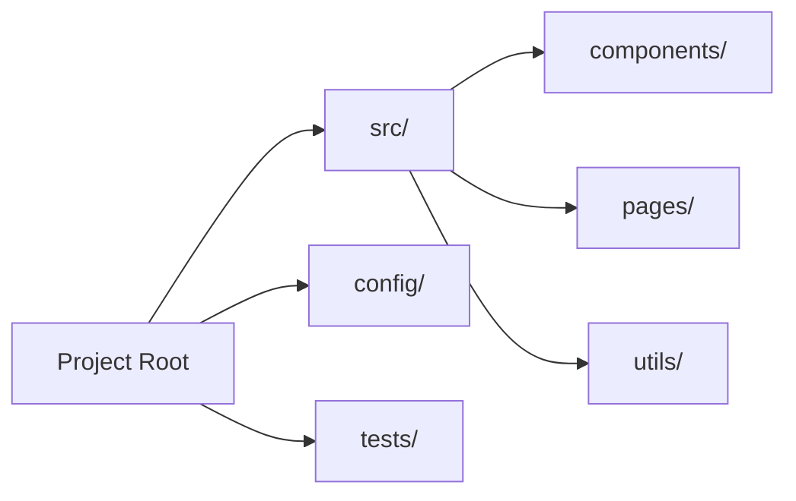

# Output Formats and Reporting

This reference contains different output formats for architecture analysis results.

## JSON Output (Technical)

Standard detailed output for technical users:
```json
{
  "summary": {
    "projectType": "vue-nuxt-application",
    "complexity": "medium",
    "maintainability": "good"
  },
  "technology": {
    "framework": "vue",
    "metaFramework": "nuxt",
    "buildTool": "vite",
    "packageManager": "pnpm"
  },
  "architecture": {
    "patterns": ["modular", "layered"],
    "structure": "feature-based",
    "typescriptCoverage": 85
  }
}
```

## Markdown Report (Human-readable)

Formatted for documentation and sharing:
```markdown
# Architecture Analysis Report

## Project Overview
- **Type**: Vue.js + Nuxt.js application
- **Complexity**: Medium
- **Maintainability**: Good

## Technology Stack
- **Framework**: Vue 3.4.0 with Nuxt 3
- **Build Tool**: Vite 5.0.0
- **Package Manager**: pnpm 8.0.0
- **TypeScript**: Enabled (85% coverage)

## Architecture Patterns
- **Modular**: Feature-based organization
- **Layered**: Clear separation of concerns

## Recommendations
1. Add ESLint configuration
2. Implement testing strategy
3. Consider adding CI/CD pipeline
```

## Executive Summary (High-level)

For stakeholders and decision makers:
```markdown
## Executive Summary

**Project**: E-commerce Platform
**Architecture Health**: ✅ Good

### Key Findings
- Modern tech stack with Vue 3 + Nuxt
- Well-structured modular architecture
- Good TypeScript adoption (85%)

### Risks
- No automated testing
- Missing code quality tools
- No CI/CD pipeline

### Recommendations
1. **Priority 1**: Implement automated testing
2. **Priority 2**: Add code quality checks
3. **Priority 3**: Set up CI/CD pipeline
```

## Mermaid Diagrams (Visual)

### Architecture Overview
```mermaid
graph TB
    subgraph "Frontend"
        Vue[Vue 3] --> Nuxt[Nuxt 3]
        Vite[Vite] --> Build[Build]
    end

    subgraph "Quality"
        ESLint[ESLint] --> Lint[Linting]
        TS[TypeScript] --> Types[Type Safety]
    end

    subgraph "Deploy"
        PM[Package Manager] --> Install[Dependencies]
        Build --> Deploy[Deployment]
    end
```

### Directory Structure


## CSV Export (Data analysis)

For spreadsheets and data analysis:
```csv
Metric,Value,Status
Framework,vue,✅
TypeScript Coverage,85,⚠️
ESLint Configured,false,❌
Tests Present,false,❌
Build Tool,vite,✅
Architecture Pattern,modular,✅
```

## Metrics Scorecard

### Scoring System
- **Excellent (90-100)**: Best practices followed
- **Good (70-89)**: Minor improvements needed
- **Fair (50-69)**: Significant improvements needed
- **Poor (0-49)**: Major issues

### Scorecard Example
```json
{
  "overallScore": 75,
  "categories": {
    "technology": {
      "score": 85,
      "details": "Modern stack, good tooling"
    },
    "architecture": {
      "score": 80,
      "details": "Well-structured, modular design"
    },
    "quality": {
      "score": 60,
      "details": "Missing testing and linting"
    },
    "maintainability": {
      "score": 75,
      "details": "Good structure, needs documentation"
    }
  }
}
```

## Comparison Report

### Before/After Comparison
```markdown
## Architecture Evolution

### Current State
- Monolithic structure
- Limited TypeScript
- No automated testing

### Recommended Improvements
- Modular architecture
- Full TypeScript adoption
- Comprehensive testing suite

### Expected Benefits
- Improved maintainability
- Better developer experience
- Higher code quality
```

## Trend Analysis

### Metrics Over Time
```json
{
  "historical": [
    {
      "date": "2024-01-01",
      "typescriptCoverage": 45,
      "testCoverage": 0,
      "complexity": "high"
    },
    {
      "date": "2024-12-15",
      "typescriptCoverage": 85,
      "testCoverage": 65,
      "complexity": "medium"
    }
  ]
}
```